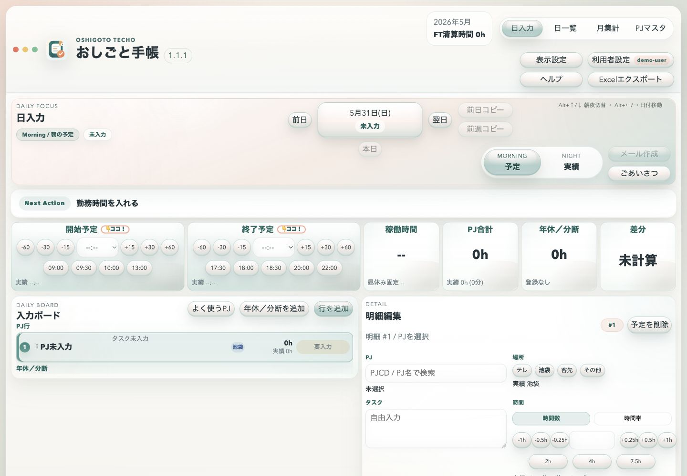

# Oshigoto Techo

[](https://github.com/hamasan74/oshigoto-techo-public/actions/workflows/ci.yml)
[](https://github.com/hamasan74/oshigoto-techo-public/actions/workflows/codeql.yml)
[](LICENSE)
[](https://github.com/hamasan74/oshigoto-techo-public/releases)

Oshigoto Techo is a local-first work log and planning app built with React and Vite.

It focuses on making daily time entry faster: planned work, actual work, breaks, split time, project totals, and month-level summaries are kept in one small PWA-style interface.

This public edition is a sanitized source release. It does not include private databases, worktree operations notes, company-specific setup scripts, generated files, or local helper binaries.

## Screenshot

The demo screenshots use synthetic local data only.



## Features

- Daily plan and actual entry views
- Project-based time details with 15-minute increments
- Break and split-time tracking
- Month summary by project
- Project master maintenance
- Local-first storage through the bundled server
- Excel backup export from the browser
- PWA manifest and service worker assets

## Maintenance

This repository is maintained as the public source edition of Oshigoto Techo.

- Roadmap: [ROADMAP.md](ROADMAP.md)
- Contribution guide: [CONTRIBUTING.md](CONTRIBUTING.md)
- Security policy: [SECURITY.md](SECURITY.md)
- Changelog: [CHANGELOG.md](CHANGELOG.md)
- Architecture: [docs/architecture.md](docs/architecture.md)
- Maintenance notes: [docs/maintenance.md](docs/maintenance.md)
- Privacy and public source hygiene: [docs/privacy.md](docs/privacy.md)
- Releases: [GitHub Releases](https://github.com/hamasan74/oshigoto-techo-public/releases)
- Code scanning: [CodeQL workflow](https://github.com/hamasan74/oshigoto-techo-public/actions/workflows/codeql.yml)
- Issue triage: bugs, documentation, maintenance, enhancements, and good first issues

The maintainer uses issues for public roadmap tracking, pull requests for reviewable changes, and releases for source snapshots.

## Tech Stack

- React
- Vite
- TypeScript
- DuckDB server-side persistence
- ExcelJS for workbook export

## Getting Started

```bash
npm install
npm run dev
```

Then open the local URL printed by the server.

For a production build:

```bash
npm run build
npm run preview
```

## Data And Privacy

Runtime data is stored locally under `data/` by default. The `data/` directory is ignored by Git and is intentionally not included in this repository.

If you need a different storage location, set `OSHIGOTO_TECHO_DB_PATH` before starting the server.

## Public Edition Notes

The private working repository contains additional operational notes, local machine scripts, generated artifacts, and private runtime data. Those files were intentionally excluded from this public edition.

The HTML mail helper binary package is also excluded. The app can still fall back to browser-based mail composition.

## Release Checks

Before public releases, the maintainer runs:

```bash
npm run build
npm audit --audit-level=high
```

The CI workflow runs the same checks on `main` and pull requests.

## License

MIT
